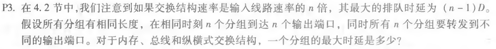
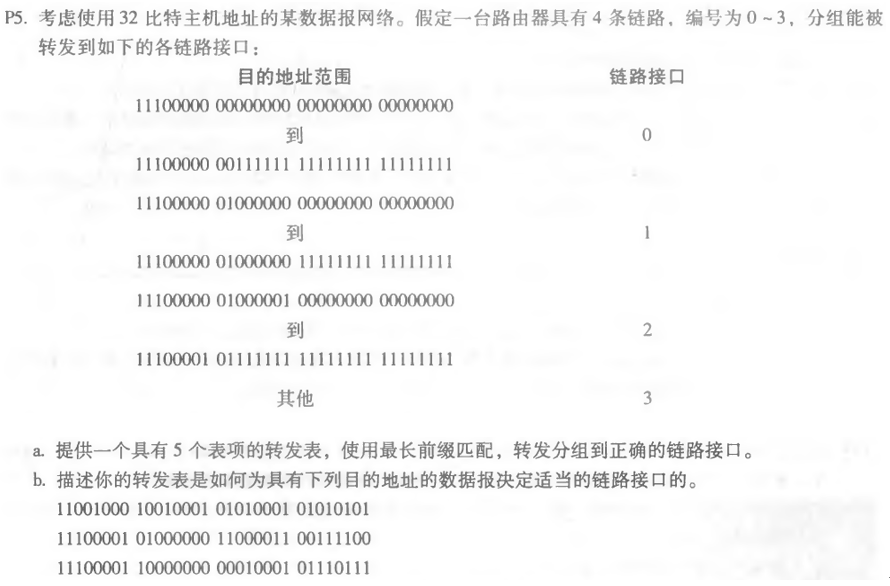
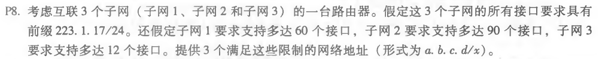

### 第七次作业

* * *

#### P3

##### 题目：

##### 作答：
a.对于内存交换结构，一个分组最大时延是(n-1)d。

b.对于总线交换结构，一个分组最大时延是(n-1)d。

c.对于纵横式交换结构，一个分组最大时延是0。

* * *

#### P5

##### 题目：

##### 作答：
a.

|目的地址范围|链路接口|
|------|---|
|11100000 00****** ******** ******** |0|
|11100000 01000000 ******** ******** |1|
|11100000 ******** ******** ******** |2|
|11100001 0******* ******** ******** |2|
|其它 | 3|

b.根据上表：
11001000 10010001 01010001 01010101最长匹配于第5个表项，也就是链路接口3.
11100001 01000000 11000011 00111100最长匹配于第4个表项，也就是链路接口2.
11100001 10000000 00010001 01110111最长匹配于第5个表项，也就是链路接口3.

* * *

#### P8

##### 题目：

##### 作答：
a.满足子网1（支持60个接口）的网络地址为223.1.17.0/26。

b.满足子网2（支持90个接口）的网络地址为223.1.17.128/25。

c.满足子网3（支持12s个接口）的网络地址为223.1.17.192/28。

* * *
