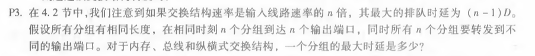
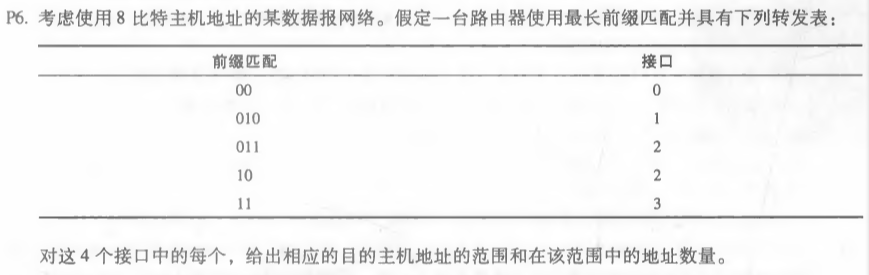
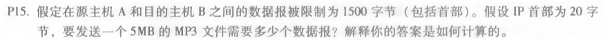

# 网络及分布式计算第七次作业

#### 2017302580018  刘佳媚

---

### 1、P3

##### 

  解：

内存交换：（n - 1）D；

总线交换：（n - 1）D；

纵横式交换：0。

​        

------

### 2、P6

##### 

  解：

|目的地址范围|接口|
|------|---|
|00000000-00111111 |0|
|01000000-01011111 |1|
|01100000-01111111| 2|
|10000000-10111111 |2|
|11000000-11111111 | 3|

接口0的地址数量=2^6=64个。

接口1的地址数量=2^5=32个。

接口2的地址数量=2^6+2^5=64+32=96个。

接口3的地址数量=2^6=64个。

---

### 3、P15

##### 

  解：

假设数据是在TCP段中携带的，TCP首部为20字节，因此每个数据报可以携带1500-40=1460字节。

5MB/1460B = 3425，可得需要3425个数据报。