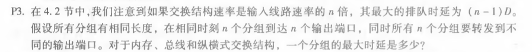
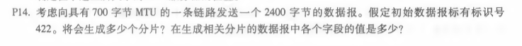

# Homework7

​											*马克*

#### 计算机网络（自顶向下）中文版课本练习（电子版p255起，课本p237起）

###### p3

答：对于内存：（n-1)D

​		对于总线：（n-1)D

​		纵横交换式结构：0

###### p5

a:

| 前缀              | 接口 |
| ----------------- | ---- |
| 11100000 00       | 0    |
| 11100000 01000000 | 1    |
| 11100000          | 2    |
| 11100001 1        | 3    |
| 其他              | 3    |

b:

第一个：3

第二个：2

第三个：3

###### p14

答：会产生4个分片

| 标识 | 标志 | 片偏移 |
| ---- | ---- | ------ |
| 422  | 1    | 0      |
| 422  | 1    | 85     |
| 422  | 1    | 170    |
| 422  | 0    | 225    |

