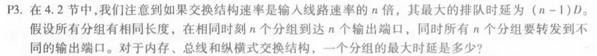
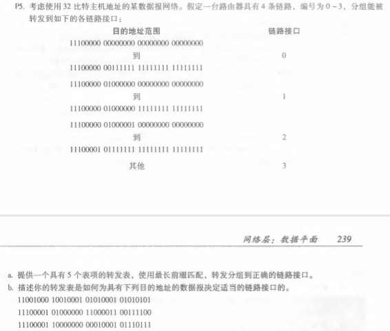
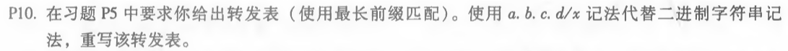

# 网络及分布式计算第七次作业

计算机学院-刁可 -2017302580031

1. P3

   

   内存：(n-1)D

   总线：(n-1)D

   纵横式：0

2.  P5

   

   a. 

   | 前缀匹配          | 链路接口 |
   | ----------------- | -------- |
   | 11100000 00       | 0        |
   | 11100000 01000000 | 1        |
   | 1110000           | 2        |
   | 11100001 1        | 3        |
   | 其他              | 3        |

   b. 利用最长前缀匹配原则：   

   11001000 10010001 01010001 01010101匹配接口3，11100001 01000000 11000011 00111100 匹配接口2，11100001 10000000 00010001 01110111匹配接口3  

3.  P10

   

   

   | 目的地址                      | 接口 |
   | ----------------------------- | ---- |
   | 11100000 00 (224.0/10)        | 0    |
   | 11100000 01000000 (224.64/16) | 1    |
   | 1110000 (224/8)               | 2    |
   | 11100001 1 (225.128/9)        | 3    |
   | 其他                          | 3    |