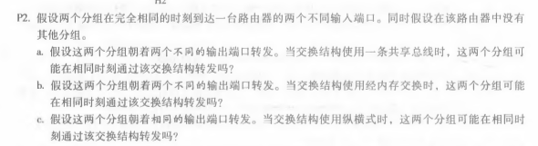
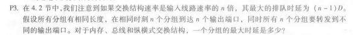
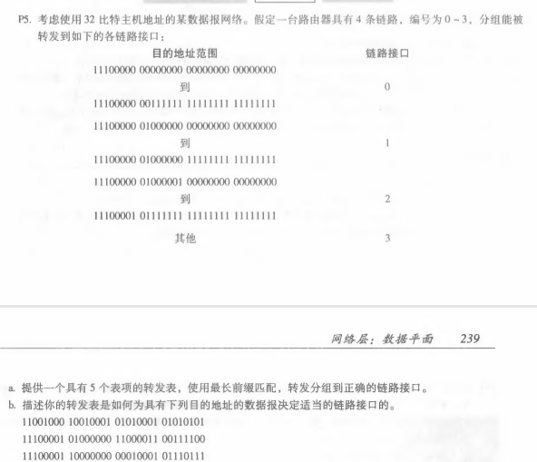

### 课后练习

******

a. 不可能，当交换结构使用共享总线时，一次只能传输一个分组。

b. 不可能，使用内存交换结构时，一次只能进行一个内存读/写操作。

c. 不可能，使用纵横式交换结构，两个包不可能在同一时间通过相同的输出总线发送。

******

- 经内存交换结构：一次只能进行一个内存读/写操作，最大时延是 (n-1)D。
- 总线交换结构：一次只能传输一个分组，最大时延是 (n-1)D。
- 纵横式交换结构：最大时延是 0。

******

a. 符合要求的转发表如下：

| 前缀匹配           | 链路接口 |
| ------------------ | :------- |
| 11100000  00       | 0        |
| 11100000  01000000 | 1        |
| 1110000            | 2        |
| 11100001  1        | 3        |
| 其他               | 3        |

b. 匹配如下：

- 11001000 10010001 01010001 01010101：无法匹配转发表的前四项，只能匹配其他，对应接口3。

- 11100001 01000000 11000011 00111100：匹配“11100000”，对应接口2。

- 11100001 10000000 00010001 01110111：匹配“11100001  1”，对应接口3。

  