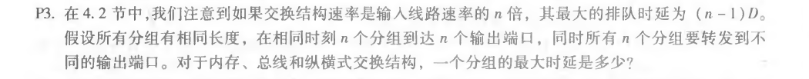

+ P3

  

  对于内存和总线而言，一个分组的最大时延取决于最大排队时延，所以为$ (n - 1)D $。对于纵横式交换结构而言，分组最大时延为0。

+ P8

  

  三个满足条件的ip地址：

  + 223.1.17.0/26 
  + 223.1.17.128/25 
  + 223.1.17.192/28 

+ P15

  

  5 MB  ==> 5\* 1024\*1024 bytes，每个数据报限制为1500字节，还要减除TCP头的20字节，所以每个数据报可以携带1460字节的文件内容。

  所以，需要的数据报数目：$ \frac{5 * 1024 * 1024}{1460} = 3592 $(向上取整)，最后一个数据报的长度没有取满1500字节，但是为了保证内容的完整性，“浪费”这一个数据报也是必需的。

