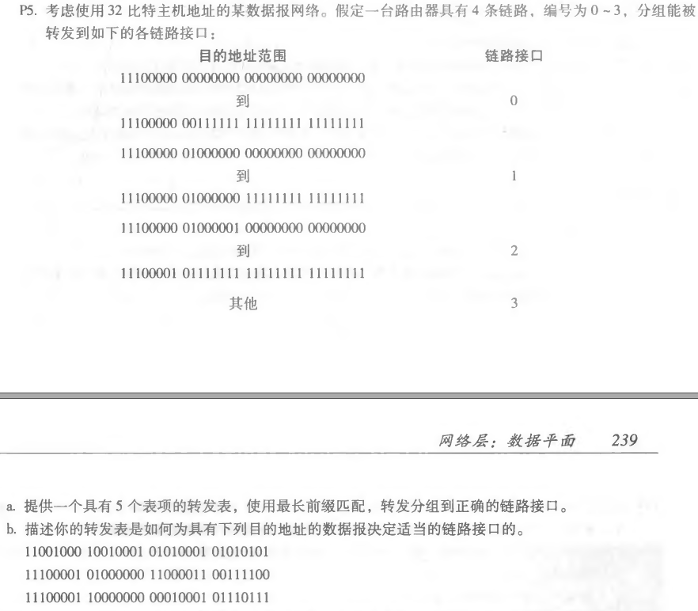
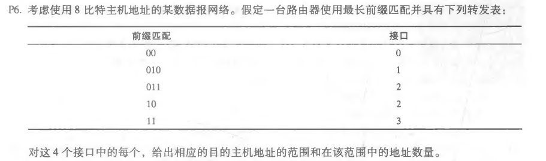
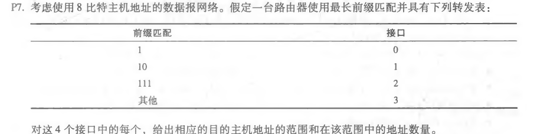

## 第7次作业

### p5



a.转发表如下：

| 前缀匹配          | 链路接口 |
| ----------------- | -------- |
| 11100000 00       | 0        |
| 11100000 01000000 | 1        |
| 1110000           | 2        |
| 11100001 1        | 3        |
| 否则              | 3        |

b.

```
(1)第一个地址前缀匹配链路接口3
(2)第二个地址前缀匹配链路接口2
(3)第三个地址前缀匹配链路接口3
```


### p6



| 目的地址范围      | 链路接口 |
| ----------------- | -------- |
| 00000000~00111111 | 0        |
| 01000000~01011111 | 1        |
| 01100000~01111111 | 2        |
| 10000000~10111111 | 2        |
| 11000000~11111111 | 3        |

```
接口0的地址数量：2^6 = 64个
接口1的地址数量：2^5 = 32个
接口2的地址数量：2^5+2^6 = 96个
接口3的地址数量：2^6 = 64个
```


### p7




| 目的地址范围      | 链路接口 |
| ----------------- | -------- |
| 11000000~11011111 | 0        |
| 10000000~10111111 | 1        |
| 11100000~11111111 | 2        |
| 00000000~01111111 | 3        |

```
接口0的地址数量：2^5 = 32个
接口1的地址数量：2^6 = 64个
接口2的地址数量：2^5 = 32个
接口3的地址数量：2^7 = 128个
```

