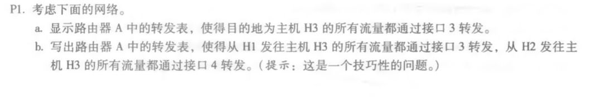
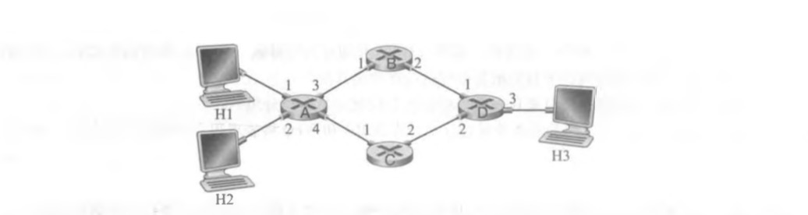
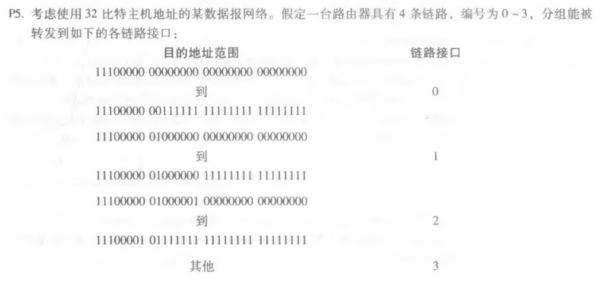
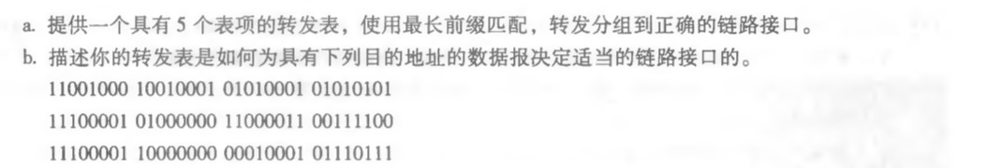
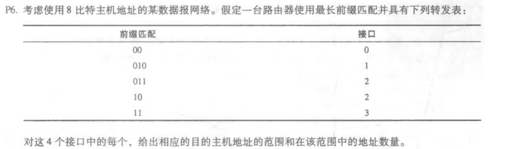

## 第四章习题

a.

| 目标地址 | 链路接口 |
| :------: | :------: |
|    H3    |    3     |

b.

转发表的接口是由目的地址决定，与发送地址无关。

a.

|                         目标地址范围                         | 链路接口 |
| :----------------------------------------------------------: | :------: |
|  11100000 00\*\*\*\*\*\* \*\*\*\*\*\*\*\* \*\*\*\*\*\*\*\*   |    0     |
|     11100000 01000000 \*\*\*\*\*\*\*\* \*\*\*\*\*\*\*\*      |    1     |
| 1110000* \*\*\*\*\*\*\*\*  \*\*\*\*\*\*\*\* \*\*\*\*\*\*\*\* |    2     |
|  11100001 1\*\*\*\*\*\*\* \*\*\*\*\*\*\*\* \*\*\*\*\*\*\*\*  |    3     |
|                             其他                             |    3     |

b.

|            目标地址范围             | 链路接口 |
| :---------------------------------: | :------: |
| 11001000 10010001 01010001 01010101 |    3     |
| 11100001 01000000 11000011 00111100 |    2     |
| 11100001 10000000 00010001 01110111 |    3     |

|              目标地址范围               |    地址数量    |
| :-------------------------------------: | :------------: |
|           00000000 - 00111111           |    2^6 = 64    |
|           01000000 - 01011111           |    2^5 = 32    |
| 01100000 - 01111111 10000000 - 10111111 | 2^5 + 2^6 = 96 |
|           11000000 - 11111111           |    2^6 = 64    |

