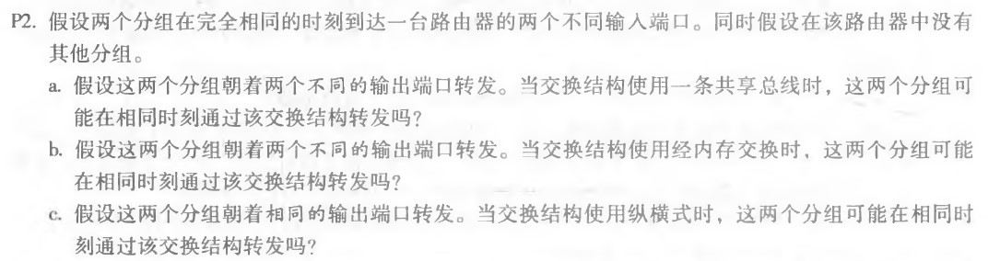
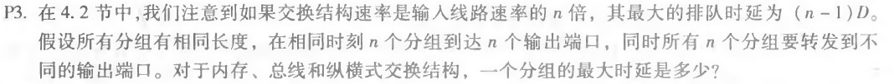
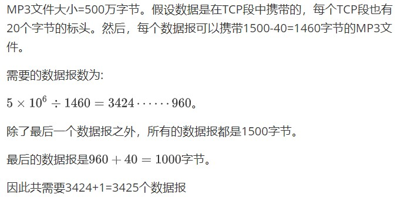

# 网络及分布式计算作业（五）

[toc]

## 课后习题

### P2

a)否，共享总线上一次只能发送一个数据包。

b)否，因为经过共享系统总线一次仅能 执行一个内存读/写，不能同时转发两个分组，即使它们有不同的目的端口。

c)否，如果来自两个不同输入端口的两个 分组其目的地为相同同的输出端口，则一个分组必须在输入端等待，因为在某个时刻经给定总线仅能够发送一个分组，因此这两个分组不能“同时”通过该交换结构转发。

### P3

a)内存式 传输是阻塞的 最大排队时延为（n-1）d 

b)总线式 传输是阻塞的 最大排队时延为（n-1）d 

c)纵横式 传输是非阻塞的 最大排队时延为0 

### P15

## Latex原文

### P15

MP3文件大小=500万字节。假设数据是在TCP段中携带的，每个TCP段也有20个字节的标头。然后，每个数据报可以携带1500-40=1460字节的MP3文件。

需要的数据报数为: 

$$ {5 \times 10^6 \div 1460}=3424 \cdots\cdots 960$$。

除了最后一个数据报之外，所有的数据报都是1500字节。

最后的数据报是$960+40=1000$字节。

因此共需要3424+1=3425个数据报