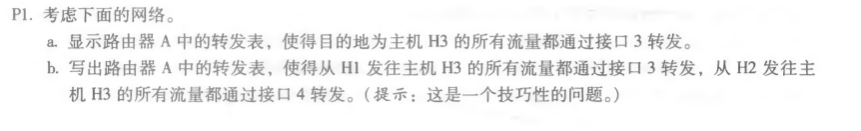
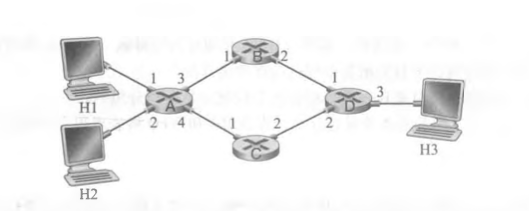
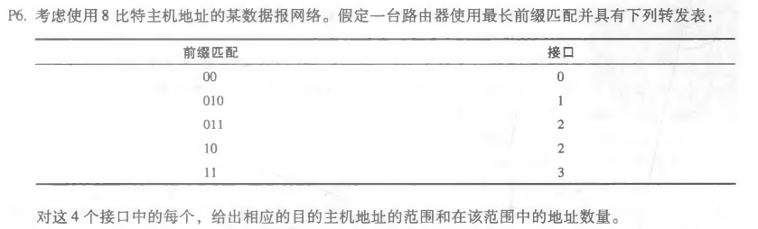
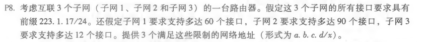

## P1

a.

| 目的地址 | 输出接口 |
| -------- | -------- |
| H3的IP   | 3        |

b.转发只能基于目的地址，因此无法实现

## P6

| 目的地址范围                         | 接口 | 地址数量                   |
| ------------------------------------ | ---- | -------------------------- |
| 00000000-00111111                    | 0    | 2^6^ = 64                  |
| 01000000-01011111                    | 1    | 2^5^ = 32                  |
| 01100000-01111111  10000000-10111111 | 2    | 2^5^ + 2^6^ = 64 + 32 = 96 |
| 11000000-11111111                    | 3    | 2^6^ = 64                  |

## P8

223.1.17.0/26

223.1.17.128/25

223.1.17.192/28 