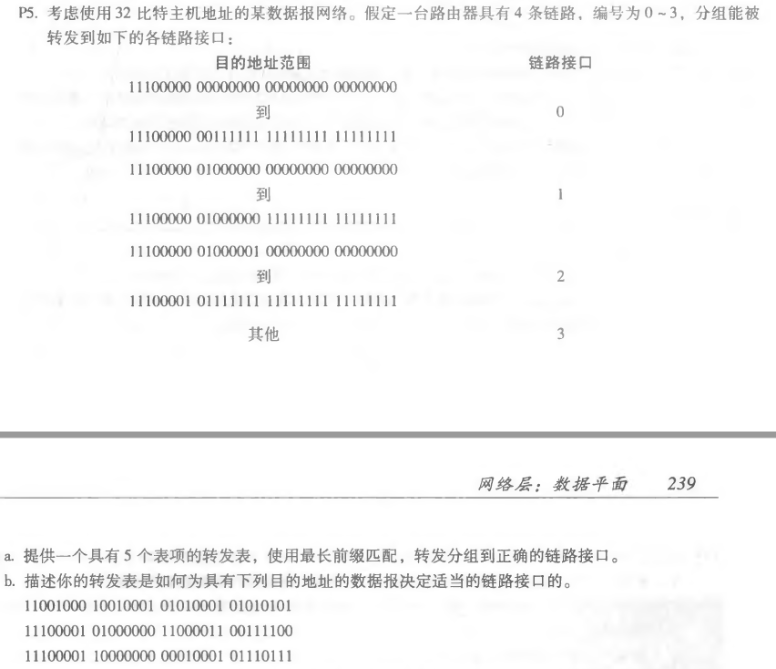
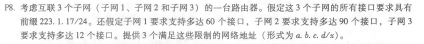
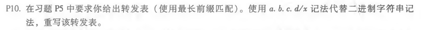

## Homework_7

**Author：**

姓名： 王泽生

学号：2017302580268

第三章习题：**P5、P8、P10**

### P5

**解答：**

a.

| 前缀匹配          | 链路接口 |
| ----------------- | -------- |
| 11100000 00       | 0        |
| 11100000 01000000 | 1        |
| 1110000           | 2        |
| 11100001 1        | 3        |
| 其他              | 3        |

b.

* 匹配前缀匹配的第五项，链路接口为 3
* 匹配前缀匹配的第三项，链路接口为 2
* 匹配前缀匹配的第四项，链路接口为 3

### P8

**解答：**

1. 223.1.17.0/26
2. 223.1.17.128/25
3. 223.1.17.192/28

### P10

**解答：**

| 目的地址                      | 链路接口 |
| ----------------------------- | -------- |
| 11100000 00 (224.0/10)        | 0        |
| 11100000 01000000 (224.64/16) | 1        |
| 1110000 (224/8)               | 2        |
| 11100001 1 (225.128/9)        | 3        |
| 其他                          | 3        |

