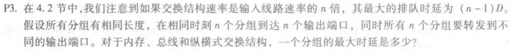
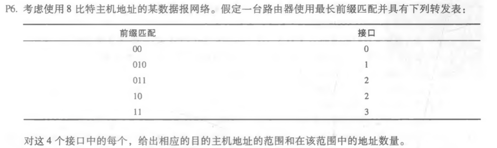
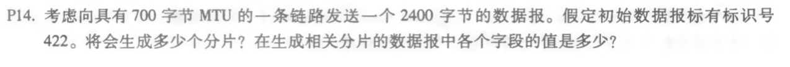

## 课后习题3道

### P3

分别是(n-1)D、(n-1)D、0。因为内存交换结构中经共享系统总线一次仅能执行一个读/写，总线交换结构一次只有一个分组能跨越总线，而纵横式交换结构只要输出端口不同，就能一起发送。

### P6

| 范围              | 接口 |
| ----------------- | ---- |
| 00000000-00111111 | 0    |
| 01000000-01011111 | 1    |
| 01100000-01111111 | 2    |
| 10000000-10111111 | 2    |
| 11000000-11111111 | 3    |

接口0地址数量：64

接口1地址数量：32

接口2地址数量：96

接口3地址数量：64

### P14

数据字段的大小为700-20=680字节，分片数=(2400-20)/680=4，标识号都是422，长度前三个是700最后一个是360，偏移量是0、85、170、255，标志位是1、1、1、0