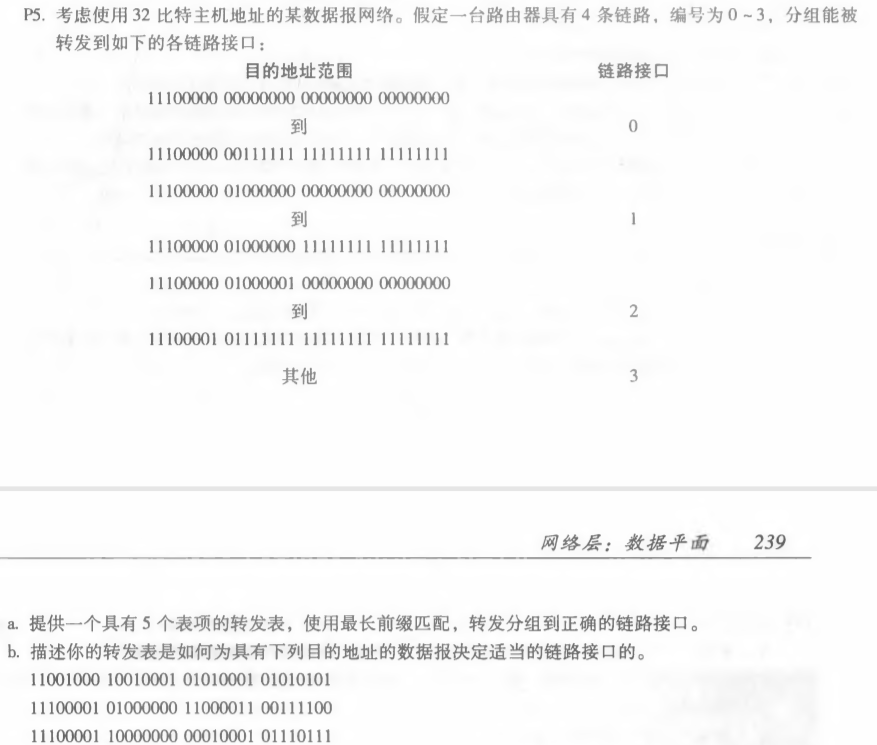
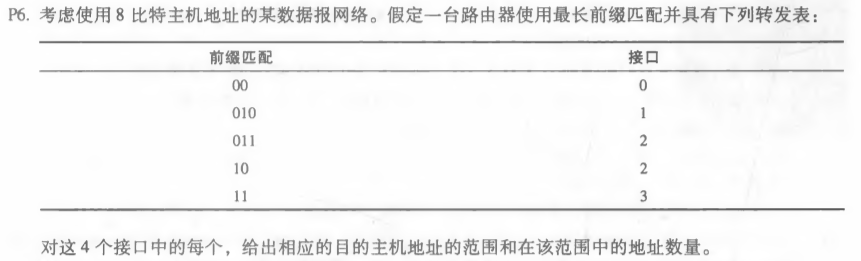
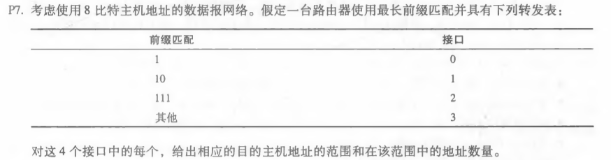

# 网络及分布式计算

## *第七次作业*

---------------------------------------------  
### 第四章课后习题任选三题  
#### P5  

##### 答：  
###### a.  
|    前缀匹配       |  链路接口 | 
| :------------- | :--------:|
| 11100000 00       | 0 |
| 11100000 01000000 | 1 |
| 1110000           | 2 |  
| 11100001 1        | 3 |
| 其他               | 3 |  
###### b.   
第一个地址链路接口为3，因为它的前缀110不在0、1、2链路接口的前缀中。  
第二个地址链路接口为2，因为它的前缀111000010满足接口2的前缀匹配且不满足接口0、1的。  
第三个地址链路接口为3，因为它的前缀111000011满足接口3的前缀匹配且不满足接口012的。  
#### P6  
  
##### 答：  
|  接口 | 地址范围 |地址数量|
|  :---:|:------------- |:--:|
| 0     | 00000000-00111111 |64|
| 1     | 01000000-01011111 |32|
| 2     | 01100000-01111111 |32| 
| 2     | 10000000-10111111 |64|
| 3     | 11000000-11111111 |64|  
#### P7  

##### 答：  
|  接口 | 地址范围 |地址数量|
|  :---:|:------------- |:--:|
| 0     | 11000000-11011111 |32|
| 1     | 10000000-10111111 |64|
| 2     | 11100000-11111111 |32|
| 3     | 00000000-01111111 |128|  
