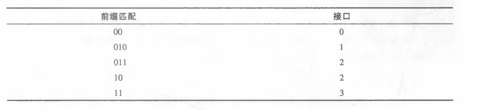

# HOMEWORK7

2017302580288  李沛昊

## P2

**问题：**假设两个分组在完全相同的时刻到达一台路由器的两个不同输入端口。同时假设在该路由器中没有 其他分组。 

a.假设这两个分组朝着两个不同的输出端口转发。当交换结构使用一条共享总线时，这两个分组可 能在相同时刻通过该交换结构转发吗？
b.假设这两个分组朝着两个不同的输岀端口转发。当交换结构使用经内存交换时，这两个分组可能 在相同时刻通过该交换结构转发吗？ 

c.假设这两个分组朝着相同的输出端口转发。当交换结构使用纵横式时，这两个分组可能在相同时 刻通过该交换结构转发吗？ 

**解答：**

a.不能，共享总线在同一时间只能转发一个分组。

b.不能，实际上内存交换也会使用到总线，这就导致在同一时刻只能有一个分组在转发。

c.不能，因为这两个分组有同样的输出端口，每个输出端口在同一时刻只能转发一个分组。

## P3

**问题：**在4. 2节中,我们注意到如果交换结构速率是输入线路速率的耳倍，其最大的排队时延为(n-l)D>0 假设所有分组有相同长度，在相同时刻n个分组到达n个输入端口，同时所有n个分组要转发到不 同的输出端口。对于内存、总线和纵横式交换结构，一个分组的最大时延是多少？ 

**解答：**

内存：最大时延为（n-1）D

总线：最大时延为（n-1）D

因为内存与总线结构只能逐一地转发分组，因此需要等待前面（n-1）个分组转发完成

纵横式：接近0，因为当每个分组的输出端口不一样时，纵横式可以并行地转发分组，所以时延接近为0，具体多少与转发网络结构相关。

## P6

**问题：**考虑使用8比特主机地址的某数据报网络。假定一台路由器使用最长前缀匹配并具有下列转发表:

对这4个接口中的每个，给出相应的目的主机地址的范围和在该范围中的地址数量。

**解答：**

端口0：[00000000,00111111]，数量为64个

端口1：[01000000,01011111]，数量为32个、

011：[,10111111]，数量为32个

端口2：[01100000,10111111]，数量为96个

端口3：[11000000,11111111]，数量为64个