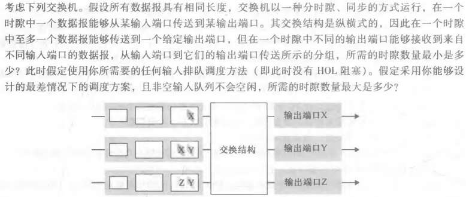
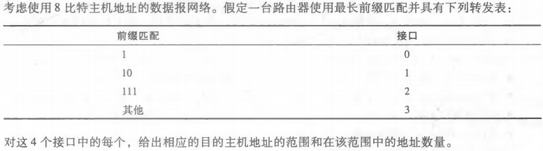

## 课后习题

## P4

最小时隙数量为3

1. 发送第一层x，发送第二层y
2. 发送第二层x，发送第三层y
3. 发送第三层z

最大时隙数量为3

## P5

a: 

| 前缀匹配          | 链路接口 |
| ----------------- | -------- |
| 11100000 00       | 0        |
| 11100000 01000000 | 1        |
| 1110000           | 2        |
| 11100000 1        | 3        |
| 其他              | 3        |

b: 

11001000 10010001 01010001 01010101  输出接口3

11100001 01000000 11000011 00111100   输出接口2

11100001 10000000 00010001 01110111  输出接口3

## P7

| 地址范围                       | 链路接口 |
| ------------------------------ | -------- |
| 11000000~11011111（32个地址）  | 0        |
| 10000000~10111111（64个地址）  | 1        |
| 11100000~11111111（32个地址）  | 2        |
| 00000000~10000000（128个地址） | 3        |

