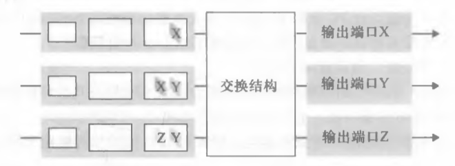
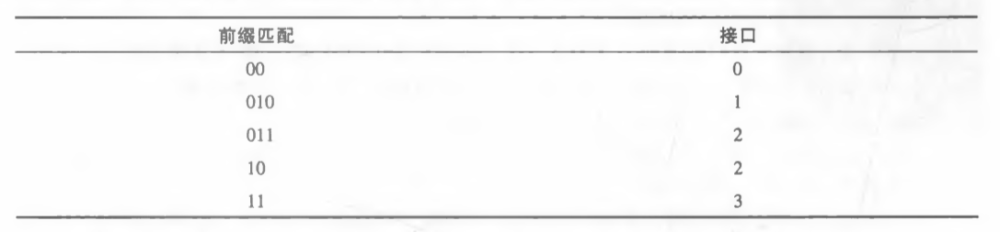

# Homework7

---

## 个人信息

- 班级：软工六班
- 学号：2017302580291
- 姓名：洪龙熙

---

## 作业

### 作业1

- 题目

> P2
>
> 假设两个分组在完全相同的时刻到达一台路由器的两个不同输入端口。同时假设在该路由器中没有其他分组。
>
> 1.  假设这两个分组朝着两个不同的输出端口转发。当交换结构使用一条共享总线时，这两个分组可能在相同时刻通过该交换结构转发吗？
> 2.  假设这两个分组朝着两个不同的输岀端口转发。当交换结构使用经内存交换时，这两个分组可能在相同时刻通过该交换结构转发吗？
> 3.  假设这两个分组朝着相同的输出端口转发。当交换结构使用纵横式时，这两个分组可能在相同时刻通过该交换结构转发吗？

-   答案
    1.  不可能。一条共享总线只能传输一个分组，即使两个分组朝着两个不同的输出端口转发。
    2.  不可能。内存读写在同一时刻只能读写一个分组。
    3.  不可能。虽然纵横式可以同时转发这两个分组，但是这两个分组的输出端口是同一个，一个端口只能同时输出一个分组。

### 作业2

- 题目

> P4
>
> 考虑下列交换机。
>
> 
>
> 假设所有数据报具有相同长度，交换机以一种分时隙、同步的方式运行，在一个时隙中一个数据报能够从某输入端口传送到某输岀端口。其交换结构是纵横式的，因此在一个时隙中至多一个数据报能够传送到一个给定输出端口，但在一个时隙中不同的输出端口能够接收到来自不同输入端口的数据报，从输入端口到它们的输岀端口传送所示的分组，所需的时隙数量最小是多少？此时假定使用你所需要的任何输入排队调度方法(即此时没有HOL阻塞)。假定采用你能够设计的最差情况下的调度方案，且非空输入队列不会空闲，所需的时隙数量最大是多少？

-   答案

    假定，自上向下，自左向右的分组分别为：X~1~；X~2~, Y~2~； Z~3~, Y~3~

    1.  所需的时隙数量最小是3：

        时隙 0~1：	X~1~ Y~2~ 传输，Y~3~ 阻塞

        时隙 1~2：	X~2~ Y~3~ 传输

        时隙 2~3：	Z~3~ 传输

    2.  所需的时隙数量最大是3：

        此时没有HOL阻塞，且非空输入队列不会空闲，所以情况如下：

        时隙 0~1：	X~1~ Y~3~ 传输，X~2~ Y~2~ Z~3~ 阻塞

        时隙 1~2：	Y~2~ Z~3~ 传输，X~2~ 阻塞

        时隙 2~3：	X~2~ 传输

    

### 作业3

- 题目

> P6
>
> 考虑使用8比特主机地址的某数据报网络。假定一台路由器使用最长前缀匹配并具有下列转发表:
>
> 
>
> 对这4个接口中的每个，给出相应的目的主机地址的范围和在该范围中的地址数量。

-   答案

    接口0：0000 0000 ~ 0011 1111

    接口1：0100 0000 ~ 0101 1111

    接口2：0110 0000 ~ 1011 1111

    接口3：1100 0000 ~ 1111 1111