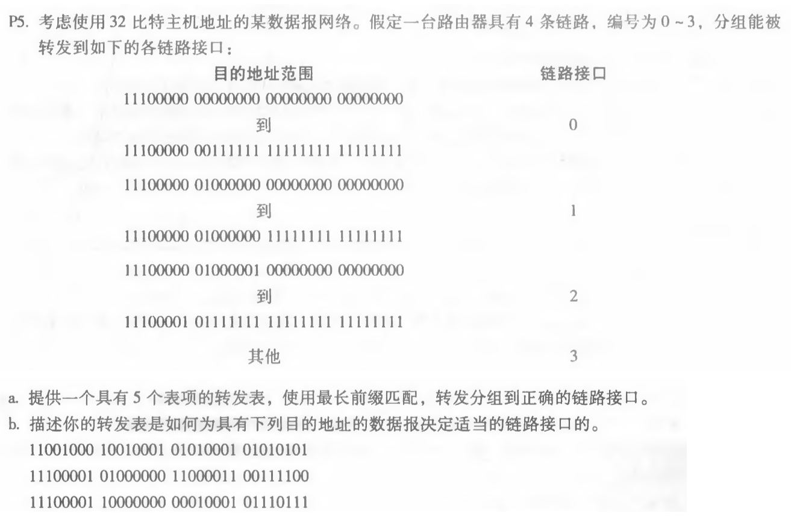
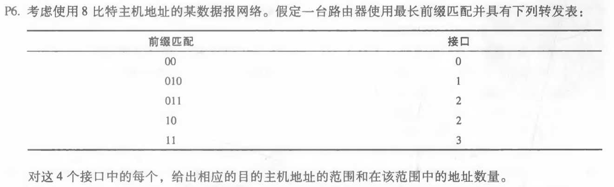
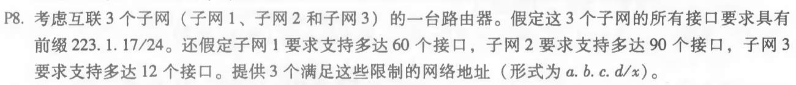

## P5
 
~~~
1)  链连接口 前缀匹配             
    0       11100000 00           
    1       11100000 01000000      
    2       1110000                 
    3       11100001 1              
    3       其他                    
 2) 11001000 10010001 01010001 01010101 接口3，对应其他
    11100001 01000000 11000011 00111100 接口2，对应1110000
    11100001 10000000 00010001 01110111 接口3，对应11100001 1
 ~~~

## P6

~~~
接口0的范围为00000000-00111111，地址数量为2^6=64
接口1的范围为01000000-01011111，地址数量为2^5=32
接口2的范围为01100000-10111111，地址数量为2^5+2^6=96
接口3的范围为11000000-11111111，地址数量为2^6=64
~~~

## P8

~~~
子网1   223.1.17.128/26
子网2   223.1.17.0/25
子网3   223.1.17.192/28
~~~
 

 
刘涛 2017302580292 2020.04.21
