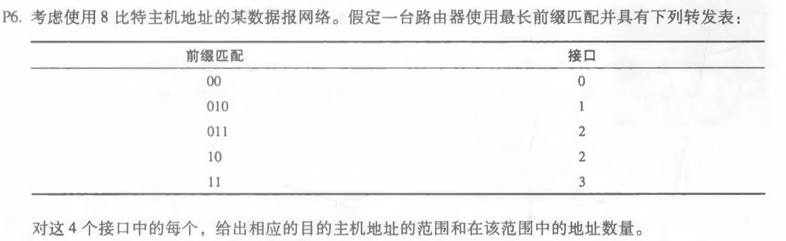
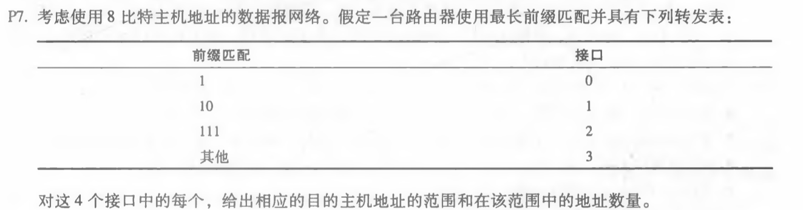

#### 1. P5

.png)

.png)

a. 使用最长前缀匹配的转发表如下：

| 前缀匹配          | 链路接口 |
| ----------------- | -------- |
| 11100000 00       | 0        |
| 11100000 01000000 | 1        |
| 1110000           | 2        |
| 11100001 1        | 3        |
| 其他              | 3        |

b. 链路接口分别为3、2、3，依次通过其他、1110000、11100001 1  前缀匹配得到。

#### 2. P6

| 目的主机范围        | 链路接口 | 地址数量 |
| ------------------- | -------- | -------- |
| 00000000 - 00111111 | 0        | 64       |
| 01000000 - 01011111 | 1        | 32       |
| 01100000 - 01111111 | 2        | 32       |
| 10000000 - 11000000 | 2        | 64       |
| 11000000 - 11111111 | 3        | 64       |

#### 3. P7

| 目的主机范围        | 链路接口 | 地址数量 |
| ------------------- | -------- | -------- |
| 11000000 - 11011111 | 0        | 32       |
| 10000000 - 10111111 | 1        | 64       |
| 11100000 - 11111111 | 2        | 32       |
| 00000000 - 01111111 | 3        | 128      |

